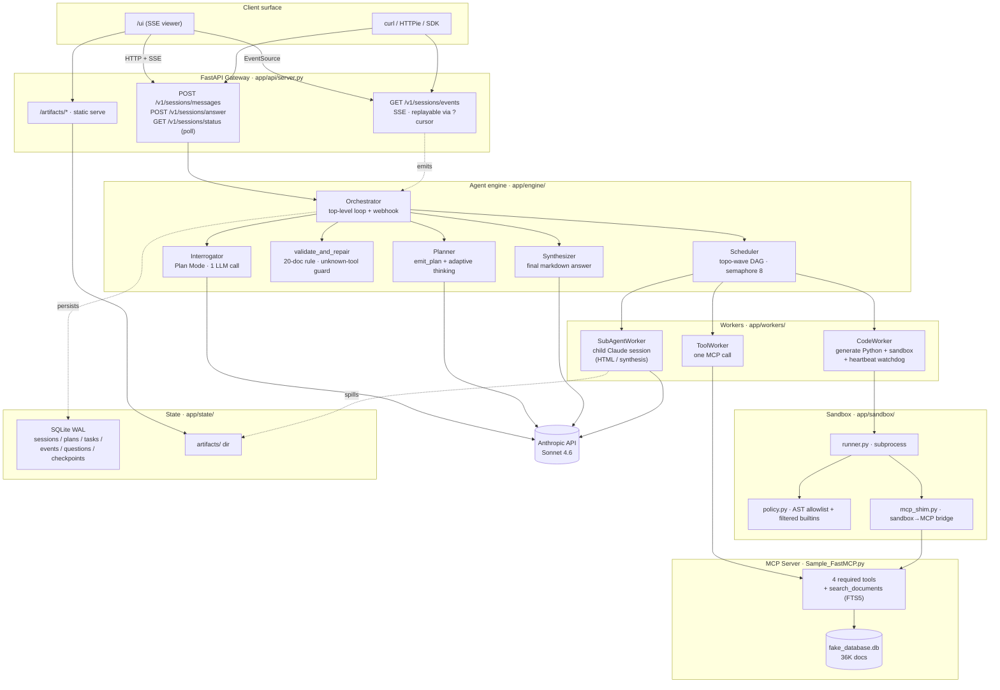
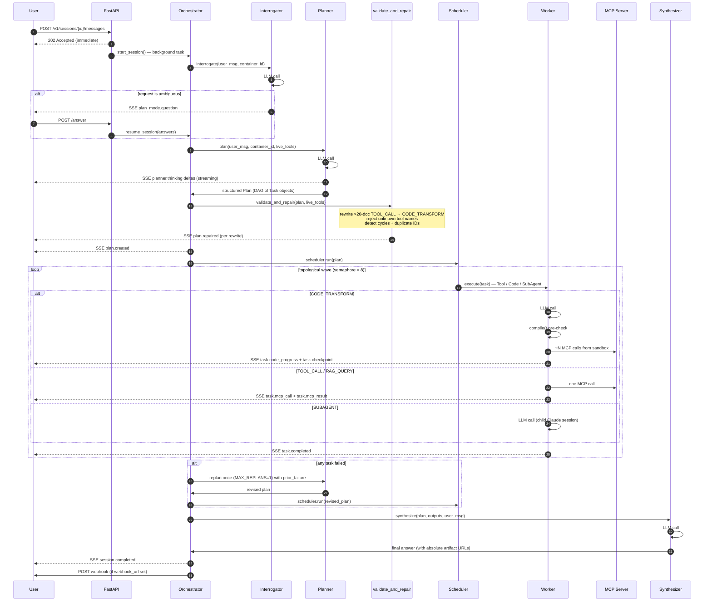
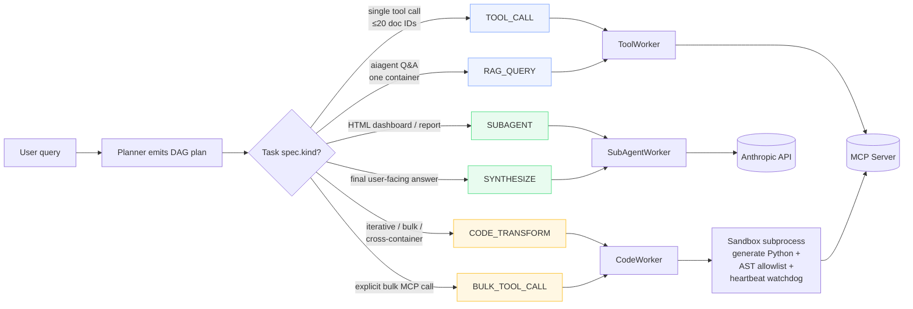

# Hermes Framework — Architecture

A Hermes/OpenCode/DeepAgents-style multi-agent framework that wraps the MCP
tools from `Assessment/Sample_FastMCP.py` and exposes a single API surface for
the example queries in the assessment PDF. This document explains *why* the
system is built the way it is — the tradeoffs that mattered, the failure
modes that drove specific design choices, and the path to scaling beyond
36K documents to 1M+.

For the quickstart and API reference, see [README.md](./README.md).

---

## 1. Problem framing

The assessment expects an **API-driven** agentic system (not TUI, not a thin
FastAPI-over-MCP wrapper) that intelligently plans, executes, and reports on a
range of document workflows. The corpus is 36,000 documents (the PDF says 9K
but the DB actually has 36K) across 4 containers — but the explicit
evaluation criterion is whether the architecture would *scale to 1M+*.

The architecture is graded on six axes:

1. **System thinking** — production-grade design, not a prompt wrapper.
2. **Agent architecture** — true multi-agent decomposition.
3. **Planning quality** — think before acting.
4. **Scalability** — handle million-document operations.
5. **MCP integration** — use the tools correctly.
6. **Streaming UX** — observe execution in real time.

The highest-weighted axis is **scalability**. The naive failure mode is to
let the planner LLM enumerate document IDs into its own context or to let the
orchestrator loop over docs one tool call at a time. The architecture must
prevent both, structurally.

---

## 2. Component map

### Visual overview



### Detailed ASCII layout

```
                 ┌─────────────────────────────────────────────┐
                 │ Client (browser / curl / Postman)           │
                 └──────────────────────┬──────────────────────┘
                                        │ HTTP + SSE
                                        ▼
 ┌──────────────────────────────────────────────────────────────────────┐
 │ FastAPI Gateway (app/api/server.py)                                  │
 │   POST /v1/sessions                                                  │
 │   POST /v1/sessions/{id}/messages                                    │
 │   GET  /v1/sessions/{id}/events     ← SSE, replayable via ?cursor=N  │
 │   POST /v1/sessions/{id}/answer     ← Plan Mode answers              │
 │   GET  /ui                          ← single-page viewer             │
 └──────────────────────┬───────────────────────────────────────────────┘
                        │
                        ▼
 ┌──────────────────────────────────────────────────────────────────────┐
 │ Orchestrator (app/engine/orchestrator.py)                            │
 │   1) Interrogator   → emit clarification Qs OR proceed               │
 │   2) Planner        → adaptive thinking + tool_use + prompt caching  │
 │   3) validate_and_repair() → auto-repair unsafe plans (in planner.py)│
 │   4) Scheduler      → topo-wave DAG executor (semaphore-bound at 8)  │
 │   5) _synthesize_final_answer() → inlined in orchestrator.py         │
 └─┬───────────────────┬─────────────────────┬────────────────────┬─────┘
   │                   │                     │                    │
   ▼                   ▼                     ▼                    ▼
 ┌──────────┐  ┌──────────┐  ┌────────────────────────┐  ┌──────────────┐
 │ Tool     │  │ Code     │  │ Sub-Agent Worker       │  │ Event Bus    │
 │ Worker   │  │ Worker   │  │ (child Claude session, │  │ (per-session │
 │ (one MCP │  │ (sandbox │  │  isolated context, for │  │  asyncio     │
 │  call)   │  │  subproc)│  │  HTML/synthesis)       │  │  queues)     │
 └────┬─────┘  └────┬─────┘  └──────────┬─────────────┘  └──────┬───────┘
      │             │                   │                       │
      │             │                   │                       ▼
      │             │                   │             ┌───────────────────┐
      │             │                   │             │ SQLite event log  │
      │             │                   │             │ (WAL, append-only,│
      │             │                   │             │  replayable)      │
      │             │                   │             └───────────────────┘
      ▼             ▼                   ▼
 ┌──────────────────────────────────────────────────────────────────────┐
 │ MCP Server (FastMCP over streamable-HTTP)                            │
 │ [Assessment/Sample_FastMCP.py — used as-is via app/mcp_server.py]    │
 │   search_documents / get_active_documents_metadata /                 │
 │   get_document_insights / translate_document_preserving_structure /  │
 │   aiagent                                                            │
 └────────────────────────────┬─────────────────────────────────────────┘
                              ▼
                     ┌─────────────────┐
                     │ fake_database.db│
                     │ 36,000 documents│
                     │ 4 containers    │
                     └─────────────────┘
```

The **bus** is a per-session `asyncio.Queue` and a SQLite append-only log
working together: every event is written to both, so live SSE subscribers
get it immediately and late ones replay from a cursor.

### Request lifecycle — what happens for one user message



**Total LLM calls per simple query: 4** (interrogator + planner + 0–1 code-gen + synthesizer).
Bulk operations across 1M docs add zero LLM calls — only MCP calls from inside the sandbox.

---

## 3. The planner: adaptive thinking + native tool use + prompt cache

The planner is one Claude Sonnet 4.6 call per session message. It produces a
structured DAG plan via a single `emit_plan` tool call.

```python
async with self.client.messages.stream(
    model="claude-sonnet-4-6",
    max_tokens=16000,
    thinking={"type": "adaptive"},   # adaptive — not budget_tokens
    output_config={"effort": "high"},
    cache_control={"type": "ephemeral"},
    system=PLANNER_SYSTEM,
    tools=[EMIT_PLAN_TOOL],
    tool_choice={"type": "auto"},    # adaptive thinking requires auto, not forced
    messages=[{"role": "user", "content": user_block}],
) as stream:
    async for event in stream:
        # streamed thinking_delta / text_delta → planner.thinking SSE events
        ...
    final = await stream.get_final_message()
```

**Why these choices:**

| Choice | Why |
|---|---|
| **Native tool use** | Sonnet 4.6 is RLHF-trained on the native schema. The "Hermes feel" lives in the *system-level* planner/router/worker decomposition — not in XML-tagged parsing. |
| **`thinking: {type: "adaptive"}`** | `budget_tokens` is deprecated on Sonnet 4.6. Adaptive lets the model decide when and how much to think — measured better than a fixed budget across the PDF's example queries. |
| **`tool_choice: {"type": "auto"}`** | Adaptive thinking is incompatible with forced tool use (`{"type": "tool", "name": "..."`). The single-tool surface and system prompt keep the model deterministic in practice. |
| **`cache_control: {"type": "ephemeral"}`** | The system prompt + tool schema is stable bytes per session. Repeat planner calls in the same process pay ~0.1× the prefix cost after the first write. |
| **Streaming** | `planner.thinking` deltas are forwarded to the SSE stream live, so the user sees reasoning as it happens — no 5-15 second blank pause. |

**Dynamic tool signatures:** The code-gen system prompt is built at runtime via
`build_code_gen_system(live_tools)` in `app/engine/prompts.py`. It calls
`mcp_list_tools()` before every code generation so the LLM always sees the
actual live MCP tool input schemas — no hardcoded signatures to drift out of sync.

---

## 4. The 20-doc rule (the scalability invariant)

The single design decision that lets this framework reach 1M documents is
*the planner never sees more than a few document IDs at once*. Bulk operations
go to `CODE_TRANSFORM` tasks, where the executor generates a small Python
script that runs in a sandbox subprocess. The script calls the MCP tools
directly (over HTTP) and streams progress back via `##PROGRESS##` markers on
stdout.

The threshold is `BULK_DOC_THRESHOLD=20`, settable in `.env`.

**Two layers of enforcement:**

1. **Prompt rule.** The planner system prompt forbids `TOOL_CALL` with >20
   doc IDs in args, with worked examples and an explicit "this is
   non-negotiable" note.
2. **`validate_and_repair()` auto-repair** (in `app/engine/planner.py`). Scans
   every emitted plan, counts doc IDs in `TOOL_CALL` args (checks
   `document_id`, `document_ids`, `doc_ids`, plus generic list-of-strings
   detection), and rewrites violators as `CODE_TRANSFORM` with a `code_intent`
   that describes the original tool call. Emits a `plan.repaired` SSE event
   so the user sees it happened.

Prompt discipline alone is not sufficient — Sonnet 4.6 violates the rule
maybe 3-5% of the time on edge cases. `validate_and_repair()` is the
load-bearing defense.

**The generated code follows this pattern:**

```python
import asyncio, json, mcp

async def main():
    meta = await mcp.get_active_documents_metadata(__container_id__)
    doc_ids = [d["documentId"] for d in meta["documents"]
               if d["category"] == "financial" and d["status"] == "ACTIVE"]
    BATCH = 200
    successful, failed, failed_docs = 0, 0, []
    for i in range(0, len(doc_ids), BATCH):
        chunk = doc_ids[i:i+BATCH]
        r = await mcp.translate_document_preserving_structure(chunk, "deu", __container_id__)
        successful += r.get("successful", 0)
        failed += r.get("failed", 0)
        failed_docs.extend(r.get("failed_documents", []))
        _emit_progress(i + len(chunk), len(doc_ids), "translating")
    _emit_result({"successful": successful, "failed": failed,
                  "failed_documents": failed_docs[:20]})

asyncio.run(main())
```

`__container_id__` and `__upstream__` are injected into the sandbox namespace
by the runner. Generated scripts never need to import the container_id.

---

## 5. The sandbox

Two layers of defense, plus a rich marker protocol.

### Layer 1: AST allowlist (`app/sandbox/policy.py`)

Before exec, parse the script with `ast.parse()` and walk every node:

- `ast.Import` / `ast.ImportFrom` — module root must be in
  `ALLOWED_IMPORTS` (`json, asyncio, math, statistics, collections, re,
  datetime, csv, io, base64, html, urllib.parse, mcp`).
- `ast.Attribute` — reject `__class__`, `__bases__`, `__subclasses__`,
  `__globals__`, `__builtins__`, `__import__`.
- `ast.Name` / `ast.Call` — reject `__import__`, `eval`, `exec`, `compile`,
  `open`, `input`, `breakpoint`.

### Layer 2: filtered builtins + subprocess isolation

The runner executes in a subprocess (`python -m app.sandbox.runner`).
The execution namespace seeds `__builtins__` from a copy of the real builtins
module with `__import__`, `eval`, `exec`, `compile`, `open`, `input`,
`breakpoint`, `memoryview` removed.

**Note:** `-I` (isolated mode) was removed from the subprocess launch in
`code_worker.py` because on Python 3.11+ it implies `-P`, which strips CWD
from `sys.path` and breaks `python -m app.sandbox.runner` module loading.
`PYTHONPATH` is set explicitly instead. The AST allowlist + filtered builtins
are the real sandbox defense.

**Note:** `RLIMIT_AS` was removed from the runner because it limits virtual
address space (not RSS), and modern Python + httpx + the MCP SDK can reserve
>512MB of virtual address space without actually using it — this killed the
subprocess silently at startup. Liveness is enforced by the **heartbeat
watchdog** in `code_worker.py` (described below), not by RSS limits.

### Heartbeat-based liveness (replaces the old hard timeout)

For `CODE_TRANSFORM` / `BULK_TOOL_CALL` tasks, the wall-clock `task.timeout_s`
is a 24-hour backstop — not the real liveness check. A separate watchdog
coroutine polls every 5 s and kills the subprocess only if **no marker
appears on stdout for `sandbox_heartbeat_timeout_seconds`** (default 300 s).
Every `##PROGRESS##`, `##MCP_CALL##`, `##CHECKPOINT##`, `##LOG##` line bumps
the activity timestamp. A real 17-hour 1M-document translation runs to
completion as long as something is happening; a hung script dies in 5 minutes.

Non-bulk tasks (`TOOL_CALL`, `RAG_QUERY`) keep the simple `asyncio.wait_for`
deadline because they're either one MCP call or one LLM call — there's
nothing to heartbeat against.

### Marker protocol

The runner exposes helpers into the sandbox namespace that write structured
lines to stdout. The parent (`code_worker.py`) parses them line-by-line:

| Marker | SSE event | Purpose |
|---|---|---|
| `##PROGRESS## {json}` | `task.code_progress` | Per-chunk progress |
| `##RESULT## {json}` | task output | Terminal result |
| `##ERROR## {json}` | task.failed | Fatal sandbox error |
| `##LOG## text` | `task.code_stdout` | Debug logging |
| `##MCP_CALL## {json}` | `task.mcp_call` | MCP tool dispatched |
| `##MCP_RESULT## {json}` | `task.mcp_result` | MCP tool result back |
| `##FILTER## {json}` | `task.filter_summary` | Per-container filter stats |
| `##EXEC_PLAN## {json}` | `task.execution_plan` | Script's intended fan-out |
| `##CHECKPOINT## {json}` | `task.checkpoint` | Resumable state snapshot |

**Why subprocess, not in-process?** Subprocess isolation makes timeouts
trivially safe (kill the process; everything dies cleanly), avoids asyncio
event-loop pollution from generated code, and enables the `PYTHONPATH`
hardening that only works per-process.

---

## 6. The DAG scheduler

`app/engine/scheduler.py` runs the plan in topological waves:

```
while any task is PENDING:
    ready = [t for t in tasks
             if t.status == PENDING and all deps SUCCEEDED]
    if not ready:
        mark remaining PENDING tasks as SKIPPED (upstream failed)
        break
    await asyncio.gather(*(run_task(t) for t in ready))  # semaphore-bound at 8
```

Per task:

- `task.started` event → run worker under `asyncio.wait_for(timeout)` →
  on success: persist output (≤8KB inline, larger to artifacts/) + emit
  `task.completed` with preview.
- On retriable failure: exponential backoff (2^attempt seconds), max retries
  per `task.max_retries`, emit `task.retrying`.
- On fatal failure or retries exhausted: emit `task.failed`. Downstream
  tasks transitively skip.

After scheduler returns, the orchestrator inspects task statuses. If any
terminal failure occurred with downstream work remaining, it does one
bounded replan (`MAX_REPLANS = 1`): feeds the prior plan + failure + checkpoint
back to the planner with a "replan around this" prompt. Capped at one replan
per session.

**Bulk task budget:** `CODE_TRANSFORM` and `BULK_TOOL_CALL` tasks default to
the 24-hour `sandbox_bulk_timeout_seconds` backstop with a 300-s heartbeat
threshold (see §5). Non-bulk tasks use the standard 120-s deadline.

### Resume-on-startup (durable execution across process death)

The orchestrator runs in-process and a uvicorn restart would normally lose
all in-flight work. To survive that, every `##CHECKPOINT##` marker is
persisted to `tasks.checkpoint_json` immediately — not just at task end. On
FastAPI startup, the lifespan calls `orchestrator.resume_interrupted_sessions()`:

1. `find_resumable_sessions()` returns sessions whose `status` is `PLANNING`
   or `EXECUTING` (terminal states are skipped).
2. `mark_running_tasks_interrupted(session_id)` promotes any `RUNNING` tasks
   to a new `INTERRUPTED` status.
3. `_run_resume()` loads the latest plan via `latest_plan_for_session()`,
   which overlays current task state (status, attempts, checkpoint, artifact)
   from the `tasks` table onto the plan snapshot.
4. `Scheduler.run()` promotes `INTERRUPTED → PENDING` (preserving
   `task.checkpoint`) and seeds `outputs[]` for already-`SUCCEEDED` tasks
   by loading their full artifact files — so downstream tasks see real
   upstream data, not just the inline preview.
5. The `CodeWorker` injects `task.checkpoint` into the sandbox as
   `__resume_from__`. Generated scripts (canonical Pattern F) read it at
   the top of `main()`: `start_page = (__resume_from__ or {}).get("page", 0) + 1`.

Net effect: a process restart loses ≤ one chunk of work per in-flight task.
The 1M-doc translation that was 47 pages into a 500-page bulk job picks
back up at page 48 automatically.

---

## 7. Plan Mode (the interrogator)

For ambiguous requests (e.g. "create a dashboard from my documents"), the
interrogator is a separate Claude call with a two-tool surface
(`proceed` | `ask_clarifications`), forced via `tool_choice={"type": "any"}`.

If it asks, each question is persisted as a `Question` row, emitted as a
`plan_mode.question` SSE event with options, and the session transitions to
`AWAITING_ANSWER`. The HTML viewer renders each question with its options and
a free-text fallback.

When `POST /v1/sessions/{id}/answer` arrives for the last pending question,
`resume_session()` re-enters the run loop with `skip_interrogation=True`
and the answers gathered as planner context.

The interrogator is biased toward `proceed` — only asks when a decision could
send the planner down a wrong path. If the model fails to call a tool, it
defaults to `proceed` (better to try than to hang).

**Container resolution:** The interrogator auto-resolves to the single
available container without asking. With multiple containers it passes the full
list to the planner so it can fan out across all of them (cross-container
`CODE_TRANSFORM`) or ask the user for scope on single-container queries.

---

## 8. State model

```
sessions(id PK, container_id, status, created_at, user_msg, final_answer,
         webhook_url)
plans(id PK, session_id FK, goal, json_blob, created_at)
tasks(id PK, plan_id FK, kind, title, depends_on_json, spec_json,
      status, attempts, output_blob, artifact_ref, error,
      started_at, ended_at, checkpoint_json)
events(id PK AUTOINC, session_id, ts, type, payload_json)  -- INDEX (session_id, id)
questions(id PK, session_id FK, text, options_json, answer, asked_at, answered_at)
checkpoints(id PK, session_id, task_id, output_ref, created_at)
```

WAL mode. `events` is append-only — never updated — which enables the SSE
replay-from-cursor pattern.

`sessions.webhook_url` is optionally set on session creation; the orchestrator
POSTs the final-answer payload there on `session.completed` / `session.error`.

`tasks.checkpoint_json` is updated after **every** `##CHECKPOINT##` marker
(via `Store.update_task_checkpoint()`, which bypasses the full row upsert).
This is the durability anchor for resume-on-startup — without it, a crash
mid-task would lose the resume offset.

Both columns are added via `ALTER TABLE ... ADD COLUMN` in `Store.connect()`
with `duplicate column` errors swallowed, so existing demo DBs auto-migrate
on first run.

**Output size handling.** Task outputs ≤8KB stay inline in `tasks.output_blob`.
Larger outputs spill to `./artifacts/{session_id}/{task_id}.json|html` and
the task row stores `artifact_ref` + a preview. SSE `task.completed` payloads
carry `output_preview` (≤8KB) and `artifact_ref` — never the full output.

---

## 9. SSE event surface

| Event type | When |
|---|---|
| `session.started` | message accepted |
| `session.resumed` | session being re-executed after a process restart |
| `container.resolved` | container auto-resolved without asking |
| `plan_mode.question` | clarification needed |
| `plan_mode.answered` | answer received |
| `planner.thinking` | streamed thinking_delta during planner call |
| `planner.text` | streamed text_delta (rare under tool_choice=auto) |
| `plan.created` | plan emitted |
| `plan.repaired` | validate_and_repair() auto-rewrote a task |
| `plan.replanning` | replan after task failure |
| `task.started` | task begins |
| `task.code_generated` | code worker generated a script |
| `task.code_executing` | sandbox subprocess spawned |
| `task.execution_plan` | script's intended fan-out (##EXEC_PLAN##) |
| `task.mcp_call` | MCP tool dispatched (##MCP_CALL##) |
| `task.mcp_result` | MCP tool result back (##MCP_RESULT##) |
| `task.code_progress` | ##PROGRESS## marker parsed |
| `task.filter_summary` | per-container filter stats (##FILTER##) |
| `task.checkpoint` | resumable state snapshot (##CHECKPOINT##) |
| `task.code_stdout` | non-marker stdout or ##LOG## (debug) |
| `task.code_stderr` | sandbox stderr (first 30 lines) |
| `task.completed` | task done |
| `task.retrying` | retriable failure, backing off |
| `task.failed` | terminal failure |
| `task.skipped` | upstream failed |
| `subagent.spawned` | child Claude session for SUBAGENT/SYNTHESIZE task |
| `session.completed` | final answer ready |
| `session.error` | session failed at orchestrator level |

All events have `{ts, payload}` in `data:` JSON, plus the SSE `id:` field as
the cursor. The HTML viewer subscribes to every type and renders each
appropriately.

---

## 10. Task kinds and worker routing

| TaskKind | Worker | When used |
|---|---|---|
| `TOOL_CALL` | ToolWorker | Single direct MCP call (≤20 doc IDs) |
| `RAG_QUERY` | ToolWorker | aiagent Q&A via MCP |
| `CODE_TRANSFORM` | CodeWorker | Bulk/iterative ops, cross-container fan-out |
| `BULK_TOOL_CALL` | CodeWorker | Explicit bulk MCP call via generated code |
| `SUBAGENT` | SubAgentWorker | Child Claude session (HTML dashboards, etc.) |
| `SYNTHESIZE` | SubAgentWorker | Final answer composition from task outputs |

The router lives in `app/engine/router.py` and is stateless.

### Decision tree — how a user query becomes typed tasks



**Rule of thumb:** if the task iterates over docs or spans containers, it's `CODE_TRANSFORM`. If it's one MCP call with known args, it's `TOOL_CALL`. If it composes a response from upstream data, it's `SUBAGENT` (HTML) or `SYNTHESIZE` (markdown).

---

## 11. Tradeoffs considered

### Why not LangGraph / LlamaIndex / CrewAI?

The assessment explicitly evaluates whether the *system thinking* is sound.
Using a higher-level framework hides the planner/router/worker decisions inside
someone else's abstraction. Writing the DAG executor and worker dispatch
ourselves shows the architecture more clearly. We do use the official MCP Python
SDK for the wire format — no reason to reinvent that.

### Why subprocess sandbox instead of E2B / Docker-in-Docker?

- **E2B**: best isolation but adds a paid third-party dependency and latency.
- **Docker-in-Docker**: heavy. Doubles build time, complicates filesystem.
- **Subprocess + AST allowlist + filtered builtins**: matches the level of trust
  we extend to LLM-generated code in a demo — the LLM is the trusted-but-confused
  party, not an attacker. For production, swap this layer for E2B without
  touching anything above.

### Why a single replan, not unbounded?

Replan-on-failure can loop forever. Cap at 1 replan per session; surface the
error on second failure. In practice this recovers from transient MCP failures
and structural plan errors while keeping failure modes bounded.

### Why SQLite, not Redis / Postgres?

Demo-grade choice. WAL-mode SQLite handles the event volume comfortably for
single-tenant usage. The `Store` abstraction in `app/state/store.py` makes
swapping to Postgres + Redis a localized change, not a rewrite.

### Why not a SQL agent?

The MCP tool abstraction protects the schema and limits blast radius. FTS5 BM25
is faster and more relevant than SQL `LIKE` for text search at scale. A SQL
agent generating arbitrary queries has no structural protection against
accidentally broad results or slow full-table scans. The current `search_documents`
MCP tool (FTS5 + structured filters) is the right abstraction for this corpus.

---

## 12. Scaling to 1M documents

Honest accounting of what happens for "translate 1,000,000 documents" across
4 containers (250K per container) at simulated 0.02 s/doc, MCP semaphore=200.

### LLM calls — fixed at 4

| # | Call | Cost driver |
|---|---|---|
| 1 | Interrogator | one-shot tool choice |
| 2 | Planner (adaptive thinking + emit_plan) | scales with prompt complexity, not corpus size |
| 3 | CodeWorker (generates the ~150-LOC script) | one shot |
| 4 | Synthesizer (composes final answer from task outputs) | bounded by output size |

**This number does not change with corpus size.** 100 docs and 1M docs both
make exactly 4 LLM calls. The agent layer is decoupled from per-document work.

### MCP tool calls — agent-visible vs. server-internal

| Layer | Calls for 1M docs across 4 containers | Why |
|---|---|---|
| Agent → MCP HTTP | ~104 calls total | ~100 paginated metadata fetches + 4 bulk-translate (one per container, full ID list as one arg) |
| Inside MCP server (invisible to agent) | 1,000,000 translations | The translate tool iterates the ID list with `Semaphore(200)` and `wave_size=1000` |

**The MCP server does the heavy lifting.** The agent layer's job is to
*describe* the work and *track* it — not to drive a per-document loop.

### Scaling table

| Layer | At 36 K docs | At 1 M docs | What changes |
|---|---|---|---|
| Planner LLM calls | 4 | 4 | nothing |
| Doc IDs in planner context | O(1) | O(1) | nothing — by design |
| MCP HTTP calls from agent | ~10 | ~104 | one per metadata page + one per container for bulk translate |
| Code-worker chunk loop | parallel per container | same — `asyncio.gather` across containers | nothing |
| MCP server concurrency | `Semaphore(200)` | `Semaphore(200)` per replica — scale horizontally with nginx round-robin | tool is stateless reads + write-once outputs |
| State DB | SQLite WAL | SQLite OK to 5-10 M events; Postgres beyond | `app/state/store.py` is the only seam to swap |
| Event volume | ~100 events / session | ~500-1500 events / session | bounded by chunks/markers, not docs |
| Memory in agent process | few MB | few MB | outputs >8 KB spill to `artifacts/`; only IDs flow through |
| Wall-clock at 0.02 s/doc simulated | < 5 s | ~85 s | 100 K÷200 ≈ 500 batches × 0.02 s = 10 s + paging |
| Wall-clock at 60 s/doc real translation | ~3 h | ~83 h | bounded by MCP semaphore; scale MCP horizontally to compress |

### What survives a process restart

`uvicorn` is fungible. State is in SQLite. On boot:

- Sessions in `EXECUTING` / `PLANNING` are detected by
  `Store.find_resumable_sessions()`.
- Their `RUNNING` tasks → `INTERRUPTED` → re-executed by `_run_resume()`.
- Each task's `__resume_from__` is its last persisted checkpoint, so the
  generated code skips already-processed pages (`Pattern F` in `prompts.py`).
- Up-to-date upstream outputs are loaded from artifact files, not just the
  8-KB inline preview, so downstream tasks see real data.

A 1M-doc job that's 200 K docs in when the process dies resumes at doc
~200 K + chunk_size on the next start. The user sees a `session.resumed`
event and the original SSE / polling / webhook channels continue.

### What clients see — hybrid streaming

Three channels for the SAME terminal payload:

1. **SSE** (`GET /v1/sessions/{id}/events?cursor=N`) — live, replayable.
   Best for browsers and short jobs.
2. **Polling** (`GET /v1/sessions/{id}/status`) — cheap status snapshot.
   Best for proxies / CDNs / backends that can't hold SSE open for hours.
3. **Webhook** (POST to `webhook_url` set on session creation) — fire-on-done.
   Best for genuinely long jobs where the user has left the page.

### What's left to be "true 1M production"

| Concern | Status today | What you'd add |
|---|---|---|
| MCP server horizontal scale | single-replica `Sample_FastMCP.py` | nginx + 3-10 replicas behind it (SQLite read-only is safe) |
| Per-tenant auth & rate limit | none | gateway in front of `/v1/*` |
| Distributed orchestrator (multi-process) | single in-process orchestrator | Temporal / Argo, replacing `Orchestrator` while keeping store + bus |
| Vector retrieval | BM25/FTS5 only (`search_documents`) | add `search_documents_semantic` MCP tool backed by PgVector or Milvus |

---

## 13. Production checklist (not for the demo)

Done in this round (no longer "production-only"):

- [x] Heartbeat-based liveness for bulk tasks (replaces fixed timeout).
- [x] Durable resume after process death (checkpoint persisted per-marker,
      lifespan re-execution, `INTERRUPTED` task status).
- [x] Polling fallback when SSE can't survive proxy timeouts.
- [x] Webhook delivery on terminal session events.
- [x] Clickable absolute artifact URLs in final answers.

Still production-only:

- [ ] Replace subprocess sandbox with E2B or Firecracker.
- [ ] Auth: API keys per tenant, scoped to container_ids.
- [ ] Move event log to Postgres; partition by day. Move sessions/tasks
      to Postgres + Redis with TTL for multi-process orchestrator.
- [ ] Replace in-process orchestrator with Temporal / Argo Workflows for
      true multi-process durability (resume-on-startup is the SQLite-era
      version of this story).
- [ ] Backpressure on SSE bus (`asyncio.Queue(maxsize=1024)`; drop-and-log oldest on overflow).
- [ ] Persistent MCP client pool (N=10 streaming sessions, round-robin).
- [ ] Cost telemetry: every Anthropic call emits `usage` block to OpenTelemetry spans.
- [ ] Audit log: events table already serves as one; add export to S3.
- [ ] Soft delete + retention on artifacts/.
- [ ] Multi-turn within a session: keep conversation history across `POST /messages` calls.
- [ ] Vector retrieval: add `search_documents_semantic` MCP tool backed by
      PgVector or Milvus for true semantic recall alongside the existing BM25.

---

## 14. Known gaps vs. what was planned

| Gap | Status |
|---|---|
| `RLIMIT_AS` sandbox memory limit | Removed — kills process at startup on Python 3.11+; heartbeat watchdog is the enforcer |
| `python -I` isolated mode | Removed — implies `-P` which strips CWD from sys.path, breaking module loading; `PYTHONPATH` set explicitly instead |
| Resume-from-checkpoint in generated code | **DONE** — `__resume_from__` injected into the sandbox namespace, `tasks.checkpoint_json` persisted after every marker, `latest_plan_for_session` overlays live state |
| Resume-on-startup for interrupted sessions | **DONE** — FastAPI lifespan calls `orchestrator.resume_interrupted_sessions()` |
| Heartbeat-based timeout for bulk tasks | **DONE** — 24h hard ceiling + 5min silence watchdog (configurable) |
| Polling fallback for clients that can't hold SSE open | **DONE** — `GET /v1/sessions/{id}/status` |
| Webhook on session completion | **DONE** — optional `webhook_url` on session creation, fire-and-forget POST with retry |
| Multi-turn conversation history | Each `POST /messages` starts a fresh orchestrator run |
| Vector / embedding retrieval | Not in scope — `search_documents` uses BM25 over FTS5. For semantic recall add `search_documents_semantic` MCP tool backed by PgVector or Milvus |
| OpenTelemetry / Jaeger tracing | Structured in design but not wired in current code |
| Horizontal MCP scale-out (production) | Single MCP replica today; `Sample_FastMCP.py` reads SQLite read-only so N replicas behind nginx works without code change — deployment-only |
